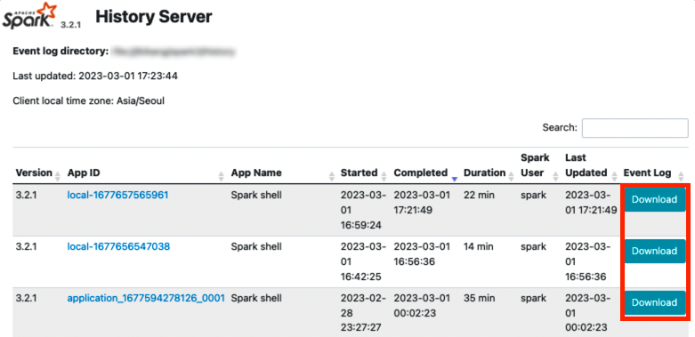
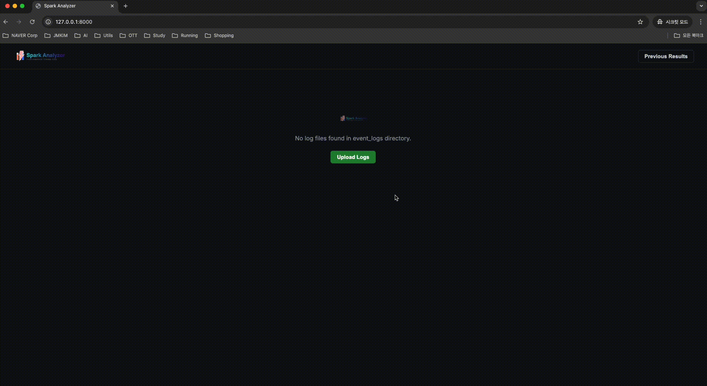
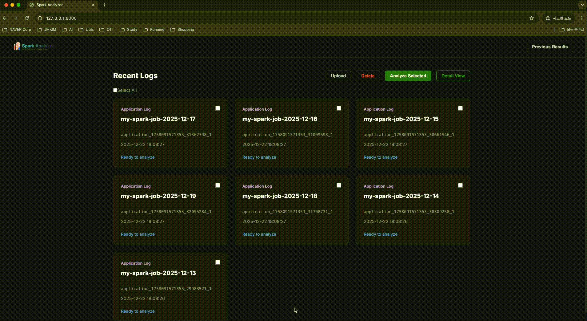
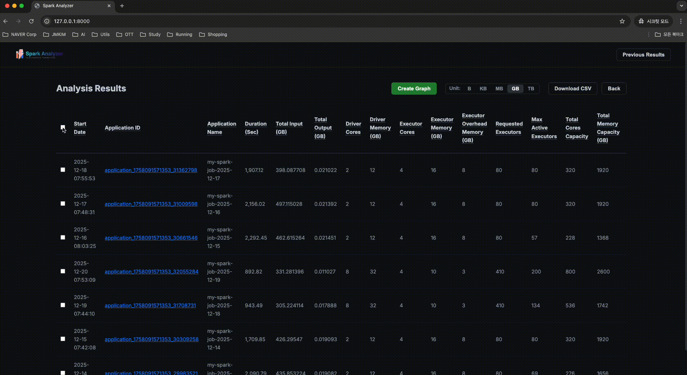
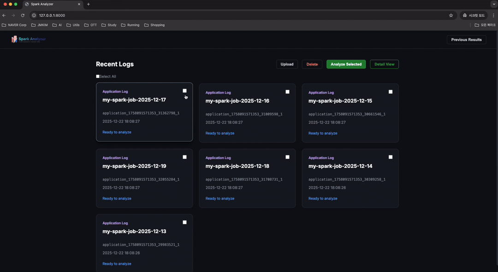

<div align="center">


--- 
**Apache Spark 리소스 튜닝을 위한 Spark 이벤트 로그 분석기**

[](https://www.python.org/downloads/)
[](https://opensource.org/licenses/MIT)
</div>


`Spark Analyzer`는 Spark History Server에서 다운로드 받은 이벤트 로그 분석 결과를 웹 기반 대시보드를 통해 Spill, Skew, Shuffle Load 등 30개 이상의 성능 지표로 계산하여 병목 지점을 식별하고 이를 데이터 엔지니어가 효율적으로 최적화할 수 있도록 돕습니다.

---

<br>

## ✨ 주요 기능 (Key Features)

### 📂 이벤트 로그 관리
- **간편한 업로드**: 드래그 앤 드롭 또는 파일 선택으로 Spark History Server에서 다운로드한 이벤트 로그 업로드
- **자동 인식**: 압축 파일(`.zstd`) 및 롤링 로그(`events_1_`, `events_2_`) 자동 처리
- **로그 관리**: 업로드된 로그 목록 조회, 선택 삭제, 애플리케이션 이름 자동 추출

### 📊 이중 분석 모드
- **요약 분석 (Summary Analysis)**: 
  - 여러 애플리케이션을 한 번에 선택하여 30개 이상의 성능 메트릭 비교 분석
  - Duration, CPU/Memory 사용률, Shuffle, Spill, I/O 등 핵심 지표 제공
  - 시계열 그래프로 메트릭 트렌드 시각화
  
- **상세 분석 (Detail View)**:
  - 단일 애플리케이션의 Stage별 상세 메트릭 분석
  - Read/Write 데이터 흐름 시각화 (파일 경로, 포맷, 파티션 수 등)
  - Executor 타임라인 차트로 리소스 활용 패턴 확인

### 🎯 30+ 성능 메트릭
리소스 최적화를 위한 핵심 지표 제공:
- **리소스**: Driver/Executor Cores/Memory, Overhead, 최대 활성 Executor 수
- **효율성**: Avg Idle Cores (%), Peak Memory Usage (%)
- **I/O**: Total Input/Output, Write Partitions (Files)
- **Shuffle**: Total/Max Shuffle Read/Write (Stage/Job별)
- **병목 지표**: Total/Max Spill (Memory/Disk), Spill 발생 Stage ID
- **안정성**: Preempted Tasks/Executors

### 🛠️ 분석 도구
- **CSV 내보내기**: 분석 결과를 CSV 파일로 다운로드하여 추가 분석 가능
- **단위 변환**: B, KB, MB, GB, TB 단위 간 실시간 전환
- **동적 정렬**: 모든 컬럼 클릭으로 오름차순/내림차순 정렬
- **컬럼 재배치**: 드래그 앤 드롭으로 테이블 컬럼 순서 변경
- **메트릭 툴팁**: 각 메트릭에 마우스 오버 시 상세 설명 표시
- **SHS 연동**: Application ID 클릭 시 Spark History Server 페이지로 바로 이동

<br>

## 🚀 빠른 시작 (Quick Start)

### 사전 요구 사항 (Prerequisites)
- **Python 3.8+** (`pyenv` 사용 권장 - 3.11)
- 최신 웹 브라우저 (Chrome, Edge, Safari)

### 설치 및 실행 (Installation & Run)
편리한 `Makefile`을 제공하여 몇 초 만에 시작할 수 있습니다.

#### 1. **Pyenv 설치**
   
   macOS에서 Homebrew를 사용하여 pyenv를 설치합니다:
   ```bash
   $ brew install pyenv pyenv-virtualenv
   ```

   설치 후 셸 설정 파일에 pyenv를 추가합니다 (`.zshrc` 또는 `.bash_profile`):
   ```bash
   $ echo 'export PYENV_ROOT="$HOME/.pyenv"' >> ~/.zshrc
   $ echo 'export PATH="$PYENV_ROOT/bin:$PATH"' >> ~/.zshrc
   $ echo 'eval "$(pyenv init --path)"' >> ~/.zshrc
   $ echo 'eval "$(pyenv init -)"' >> ~/.zshrc
   $ echo 'eval "$(pyenv virtualenv-init -)"' >> ~/.zshrc
   ```

   셸을 재시작하거나 설정을 다시 로드합니다:
   ```bash
   $ source ~/.zshrc
   ```

#### 2. **Python 3.11 설치**
   
   pyenv를 사용하여 Python 3.11을 설치합니다:
   ```bash
   $ pyenv install 3.11
   ```

   설치 가능한 Python 버전 확인:
   ```bash
   $ pyenv install --list | grep 3.11
   ```

#### 3. **가상환경 생성 및 활성화**
   
   Python 3.11 기반의 `spark_analyzer_env` 가상환경을 생성합니다:
   ```bash
   $ pyenv virtualenv 3.11 spark_analyzer_env
   ```

   프로젝트 디렉토리로 이동하여 가상환경을 활성화합니다:
   ```bash
   $ cd /path/to/spark_analyzer
   $ pyenv activate spark_analyzer_env
   ```

   또는 프로젝트 디렉토리에서 자동으로 활성화되도록 설정:
   ```bash
   $ pyenv local spark_analyzer_env
   ```

#### 4. **의존성 패키지 설치**
   
   가상환경이 활성화된 상태에서 `requirements.txt`의 패키지를 설치합니다:
   ```bash
   (spark_analyzer_env) $ pip install -r requirements.txt
   ```

   설치 확인:
   ```bash
   (spark_analyzer_env) $ pip list
   ```

#### 5. **애플리케이션 실행**
   `SHS_URL` 환경변수를 설정하여 Spark History Server와 연동할 수 있습니다. (기본값: `http://localhost:18080`)

   ```bash
   # 포그라운드 (개발용)
   (spark_analyzer_env) $ make run

   # 백그라운드 (서비스용)
   (spark_analyzer_env) $ export SHS_URL="http://spark-history-server:18080"
   (spark_analyzer_env) $ make start

   # 사용자 정의 SHS URL 사용 예시
   (spark_analyzer_env) $ export SHS_URL="http://spark-history-server:18080"
   (spark_analyzer_env) $ make run
   ```

   > **SHS 연동**: 편의를 위해 환경변수가 설정되면, 분석 결과의 **Application ID**를 클릭했을 때 해당 Spark History Server 페이지로 바로 이동합니다.

#### 6. **대시보드 접속**
   브라우저에서 [http://localhost:8000](http://localhost:8000)을 엽니다.

> **참고**: 
> - 백그라운드 서비스를 중지하려면 `make stop`을 실행하세요.
> - 환경을 초기화하려면 `make clean`을 사용하세요.
> - 가상환경을 비활성화하려면 `pyenv deactivate`를 실행하세요.

<br>

## Spark History Server Event Log 다운로드 및 업로드

* Spark History Server에서 분석할 Application의 Event Log를 다운로드 받은 후 아래 `Unpload log files` 처럼 Event Log 파일을 `Spark Analyzer`에 업로드 하세요.



<br>

## 📸 Snapshots
### Upload log files



### Analyze Seleted



### Create Graph



### Detail View




## 📁 프로젝트 구조 (Project Structure)

```text
spark_analyzer/
├── Makefile                    # 실행 관리
├── requirements.txt            # 의존성 목록
├── web_app.py                  # FastAPI 서버
├── spark_log_parser.py         # 로그 파싱 엔진
├── spark_metric_definitions.json # 메트릭 정의
├── event_logs/                 # 로그 저장소
├── latest_analysis_result.csv  # 분석 캐시
└── static/                     # 프론트엔드 리소스
    ├── index.html              # SPA 진입점
    ├── css/style.css           # 모던 스타일링
    └── js/app.js               # 앱 로직
```

<br>

## 🎯 리소스 최적화 방법론 요약(Resource Optimization Methodology Summary)

> 상세 문서: https://velog.io/@todaybow/spark-executor-resource-tuning-guide

Spark Analyzer를 활용하여 **Spark History Server**에서 원하는 기간의 Event Log를 다운로드하고, 메트릭 분석 결과를 바탕으로 애플리케이션 성격에 맞는 리소스 최적화를 수행할 수 있습니다.

### 최적화 워크플로우

1. **Event Log 수집**: Spark History Server에서 분석하려는 기간의 Event Log 다운로드
2. **메트릭 분석**: Spark Analyzer로 업로드하여 Duration, Idle Cores, Peak Memory, Spill, Shuffle 등 주요 메트릭 확인
3. **전략 선택**: 애플리케이션 특성에 따라 Static 또는 Dynamic Allocation 전략 적용
4. **리소스 산정**: 분석된 메트릭을 기반으로 최적의 Executor 수, 메모리, 코어 수 계산

### 주요 분석 메트릭

Spark Analyzer는 다음과 같은 핵심 메트릭을 제공하여 리소스 최적화를 지원합니다:

| 메트릭 | 설명 | 최적화 힌트 |
|:---|:---|:---|
| **Duration** | 전체 작업 실행 시간 | 병렬성 조정으로 단축 가능 |
| **Idle Cores (%)** | 유휴 코어 비율 | 높을수록 리소스 낭비 → 코어 수 감소 고려 |
| **Peak Memory (%)** | 최대 메모리 사용률 | 90% 이상 시 메모리 증설 필요 |
| **Total/Max Spill (Disk)** | 디스크 스필 발생량 | 메모리 부족 신호 → 메모리 증설 또는 파티션 조정 |
| **Max Shuffle Read/Write** | 최대 셔플 데이터 크기 | 파티션 수 및 메모리 산정의 기준 |

### 🚀 전략 1: Static Allocation (균등한 데이터 패턴)

**적용 대상**: Input/Output/Shuffle 크기가 일정하고 데이터 분포가 고른 배치 작업

**핵심 설정**:
- **Partition Size**: 128MB (HDFS I/O 최적화)
- **Executor Spec**: 4 cores / 6GB memory
- **Waves**: 3-10회 (병렬 처리 배수)
- **Safety Factor**: 3-5

**산정 예시** (Max Shuffle 1TB 기준):
```
1. Shuffle Partitions = 1TB / 128MB = 8,192개
2. Total Cores = 8,192 / 10 waves = 820 cores
3. Executor Instances = 820 / 4 = 205개
4. Executor Memory = (128MB * 3 * 4 * 2 / 0.6) + 300MB ≈ 6GB
```

> **💡 Tip**: Spark Analyzer의 **Idle Cores** 지표가 높다면 Executor 수를 줄이고, **Spill** 발생 시 메모리를 증설하세요.

### 🚀 전략 2: Dynamic Allocation (불균등한 데이터 패턴)

**적용 대상**: Join/Explode/Inline으로 중간 셔플 급증, 실행마다 데이터 편차가 큰 작업

**핵심 설정**:
- **Partition Size**: 64MB (Data Skew 저항성 강화)
- **Executor Spec**: 4 cores / 10GB memory
- **Safety Factor**: 3-20 (Skew 고려)
- **Dynamic Config**: `spark.dynamicAllocation.enabled=true`

**산정 예시** (Max Shuffle 1TB 기준):
```
1. Shuffle Partitions = 1TB / 64MB = 16,384개
2. Total Cores = 16,384 / 10 waves = 1,639 cores
3. Max Executors = 1,639 / 4 = 410개
4. Executor Memory = (64MB * 10 * 4 * 2 / 0.6) + 300MB ≈ 10GB
```

> **⚠️ Warning**: **Max Spill (Disk)** 값이 크거나 특정 Stage에서 Task Duration이 불균등하다면 Dynamic Allocation + 작은 파티션 전략을 적용하세요.

### 실전 활용 가이드

1. **메트릭 수집**: 최소 1주일 이상의 Event Log를 Spark Analyzer로 분석
2. **패턴 파악**: 
   - Shuffle 크기가 일정 → Static Allocation
   - Shuffle 크기 변동 큰 경우 → Dynamic Allocation
3. **리소스 계산**: 위 공식을 활용하여 Executor 수, 메모리 산정
4. **검증 및 튜닝**: 적용 후 다시 분석하여 Idle Cores, Spill 개선 확인

### Spark Executor 메모리 구주별 상세 계산표(Spec Sheet)
**(spark.memory.fraction=0.6, spark.executor.memoryOverheadFactor=0.1 기준)**

| Memory (Heap) | Overhead (Min 384MB) | Unified Total | Execution / Storage (5:5) | 비고 |
| :--- | :--- | :--- | :--- | :--- |
| **2g** | 384 MB | 1,049 MB | 524 MB / 524 MB | 소규모 작업용 |
| **4g** | 410 MB | 2,278 MB | 1,139 MB / 1,139 MB | |
| **6g** | 614 MB | 3,506 MB | 1,753 MB / 1,753 MB | **Static 권장** |
| **8g** | 819 MB | 4,735 MB | 2,368 MB / 2,368 MB | |
| **10g** | 1,024 MB | 5,964 MB | 2,982 MB / 2,982 MB | **Dynamic 권장** |
| **12g** | 1,229 MB | 7,193 MB | 3,596 MB / 3,596 MB | |
| **16g** | 1,638 MB | 9,650 MB | 4,825 MB / 4,825 MB | |
| **20g** | 2,048 MB | 12,108 MB | 6,054 MB / 6,054 MB | |
| **24g** | 2,458 MB | 14,565 MB | 7,283 MB / 7,283 MB | 대규모 집계용 |
| **30g** | 3,072 MB | 18,252 MB | 9,126 MB / 9,126 MB | 대규모 집계용 |
| **36g** | 3,686 MB | 21,938 MB | 10,969 MB / 10,969 MB | 대규모 집계용 |

### 참고 자료

리소스 산정에 대한 상세한 배경 지식과 계산 공식은 다음 문서를 참고하세요:
- [Spark Executor 리소스 튜닝 가이드(Static vs Dynamic Allocation)](https://velog.io/@todaybow/spark-executor-resource-tuning-guide)
- [Spark Executor Memory 구조 및 Shuffle Spill 분석](https://velog.io/@todaybow/spark-executor-memory-architectures)
- Spark 공식 문서: [Monitoring and Instrumentation](https://spark.apache.org/docs/latest/monitoring.html)
