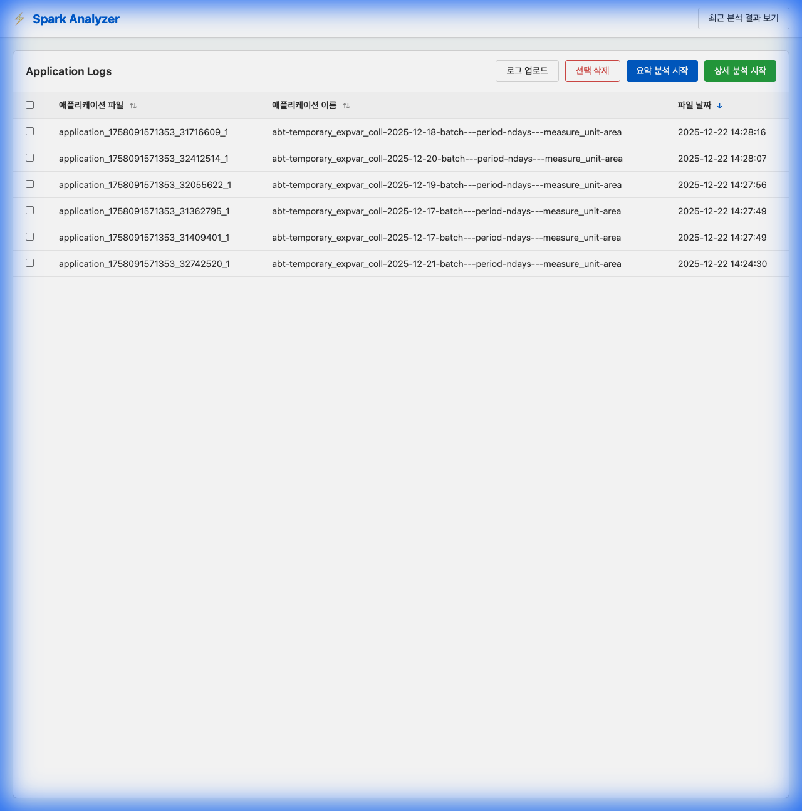
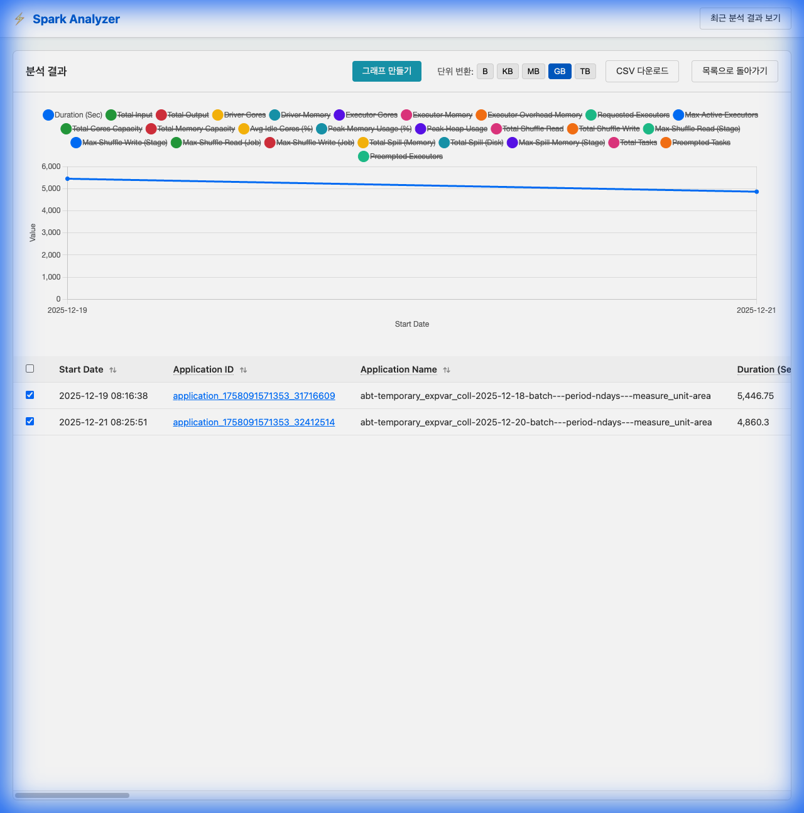
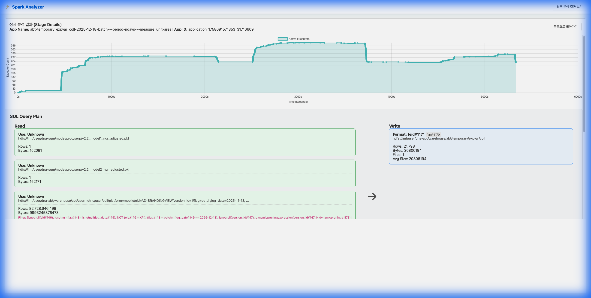

# Spark Analyzer

**Spark Analyzer**는 Apache Spark 애플리케이션의 이벤트 로그(Event Log)를 정밀 분석하여 성능 튜닝에 필요한 핵심 메트릭을 시각화해주는 웹 기반 도구입니다. 대용량 로그를 파싱하여 직관적인 대시보드를 제공하며, 전체 요약 분석과 단계별 상세 분석 기능을 통해 병목 지점(Spill, Skew, Shuffle load 등)을 신속하게 파악할 수 있습니다.

## 주요 기능 (Key Features)

*   **로그 관리 & 업로드**: 드래그 앤 드롭 또는 파일 선택으로 Spark 로그를 쉽게 업로드하고 관리(검색/삭제/정렬)할 수 있습니다.
*   **요약 분석 (Summary Analysis)**:
    *   다수의 애플리케이션을 한눈에 비교 분석.
    *   **핵심 지표**: Duration, CPU/Memory Usage, Shuffle Read/Write, Spill(Memory/Disk) 등 30여 종.
    *   **Max Spill (Stage)**: 가장 심각한 메모리 스필이 발생한 스테이지를 자동으로 식별.
*   **상세 분석 (Detailed Analysis)**:
    *   특정 애플리케이션의 **Stage 단위 실행 세부 정보** 제공.
    *   **쿼리/작업 설명 (Description)**: SQL 쿼리 내용(Join, Group By 등) 및 작업 위치 표시.
    *   **파티션 균형 (Skewness)**: 작업당 평균 입력(Avg Input/Task) 및 데이터 편향 확인.
*   **편의 기능**:
    *   **CSV 다운로드**: 분석 결과를 엑셀이나 다른 도구에서 활용할 수 있도록 CSV 파일로 내보내기 지원.
    *   **메트릭 툴팁**: 컬럼 헤더에 마우스를 올리면 해당 지표의 기술적 정의(Definition) 표시.
    *   **동적 UI**: 컬럼 정렬(Sorting), 순서 변경(Drag & Drop), 단위 변환(B~TB) 지원.

---

## 프로젝트 구조 (Project Structure)

```text
spark_analyzer/
├── Makefile                    # 실행 및 관리 스크립트 (Start/Stop/Clean)
├── requirements.txt            # Python 의존성 라이브러리 목록
├── web_app.py                  # FastAPI 기반 웹 서버 및 API 엔드포인트
├── spark_log_parser.py         # Spark 이벤트 로그 파싱 엔진
├── spark_metric_definitions.json # 메트릭 용어 및 설명 정의 파일
├── event_logs/                 # 업로드된 Spark 로그 파일 저장소
├── latest_analysis_result.csv  # 최근 분석 결과 임시 저장 파일
└── static/                     # 프론트엔드 리소스
    ├── index.html              # 단일 페이지 애플리케이션 (SPA) 진입점
    ├── css/
    │   └── style.css           # 모던 UI 스타일링 (다크 모드, 반응형 테이블)
    └── js/
        └── app.js              # 프론트엔드 비즈니스 로직 (비동기 통신, DOM 조작)
```

---

## 설치 및 실행 가이드 (Installation & Usage)

본 프로젝트는 편의를 위해 `Makefile`을 제공합니다. 터미널 명령어를 통해 손쉽게 설치하고 실행할 수 있습니다.

### 1. 사전 요구 사항 (Prerequisites)
*   **Python 3.8** 이상 (3.11 권장)
*   Chrome, Safari, Edge 등 최신 웹 브라우저

#### [참고] pyenv를 이용한 Python 3.11 가상환경 설정 가이드
Python 버전 관리 도구인 `pyenv`를 사용하여 3.11 환경을 독립적으로 구성하는 것을 권장합니다.

1.  **Python 3.11.7 설치**:
    ```bash
    pyenv install 3.11.7
    ```

2.  **가상환경 생성**:
    ```bash
    pyenv virtualenv 3.11.7 spark_analyzer_env
    ```

3.  **가상환경 활성화 (Activate)**:
    프로젝트 폴더에서 다음 명령어를 실행하면 자동으로 활성화됩니다.
    ```bash
    pyenv local spark_analyzer_env
    ```
    (또는 `pyenv activate spark_analyzer_env`)

### 2. 설치 (Installation)
프로젝트 라이브러리를 설치합니다. (가상 환경 활성화 상태에서 실행 권장)

```bash
make install
```

### 3. 애플리케이션 실행 (Run)

#### 포그라운드 실행 (개발 및 디버깅용)
로그를 터미널에서 직접 확인하며 실행합니다. 종료하려면 `Ctrl+C`를 누르세요.
```bash
make run
```

#### 백그라운드 실행 (서비스용)
서버를 백그라운드 데몬으로 실행합니다. 터미널을 종료해도 서버는 유지됩니다.
```bash
make start
```

### 4. 애플리케이션 종료 (Stop)
백그라운드에서 실행 중인 서버를 종료합니다.
```bash
make stop
```

### 5. 정리 (Clean)
생성된 캐시 파일(.pyc), 로그 파일, 분석 결과 파일 등을 정리하여 초기 상태로 되돌립니다.
```bash
make clean
```

---

## 사용 방법 (User Guide)

1.  **접속**: 브라우저 주소창에 `http://localhost:8000` 입력.
2.  **로그 준비**: 분석할 Spark Event Log 파일들을 `로그 업로드` 버튼을 통해 추가합니다.
3.  **요약 분석**:
    *   목록에서 여러 개의 파일을 체크합니다 (전체 선택 가능).
    *   **`요약 분석 시작`** 버튼 클릭.
    *   결과 테이블에서 애플리케이션 간 성능 지표를 비교합니다. 필요시 `CSV 다운로드`로 저장합니다.
4.  **상세 분석**:
    *   목록에서 **단 하나**의 파일을 체크합니다.
    *   **`상세 분석 시작`** (초록색) 버튼 클릭.
    *   해당 애플리케이션의 Stage별 상세 수행 시간, 데이터 입출력량, 작업 설명을 확인하여 구체적인 튜닝 포인트를 찾습니다.

---

## 스크린샷 및 사용 예시 (Screenshots & Usage)

### 1. 메인 화면 & 로그 파일 관리 (Main List)
Spark 이벤트 로그 파일을 업로드하고, 분석할 파일을 관리하는 메인 화면입니다.


### 2. 최근 분석 결과 (Analysis Results)
분석 완료된 애플리케이션의 주요 메트릭(Duration, Spill, Input/Output 등)을 테이블 형태로 한눈에 확인할 수 있습니다.


### 3. 비교 그래프 (Summary Graph)
여러 애플리케이션을 체크박스로 선택한 후 `그래프 만들기` 버튼을 클릭하면, 수행 시간 및 리소스 사용량 추이를 시각적으로 비교할 수 있습니다.


### 4. 상세 분석 플로우 (Detail Flow)
특정 애플리케이션의 상세 분석(돋보기 아이콘)으로 진입하면, 전체 데이터 흐름(Read &rarr; Write)과 데이터 포맷, 사이즈를 직관적인 카드 형태로 확인할 수 있습니다.

